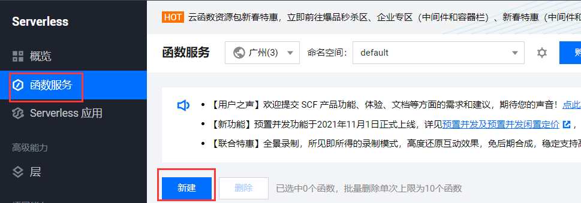
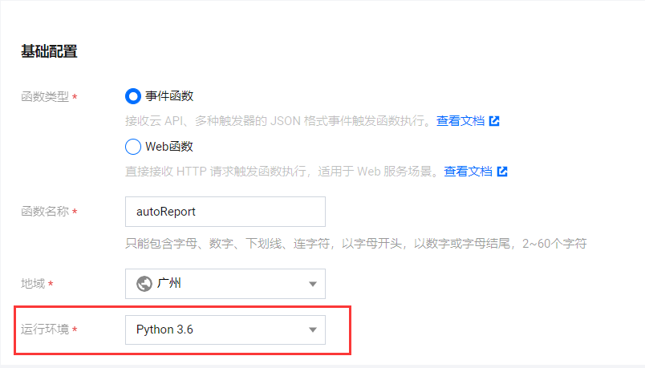
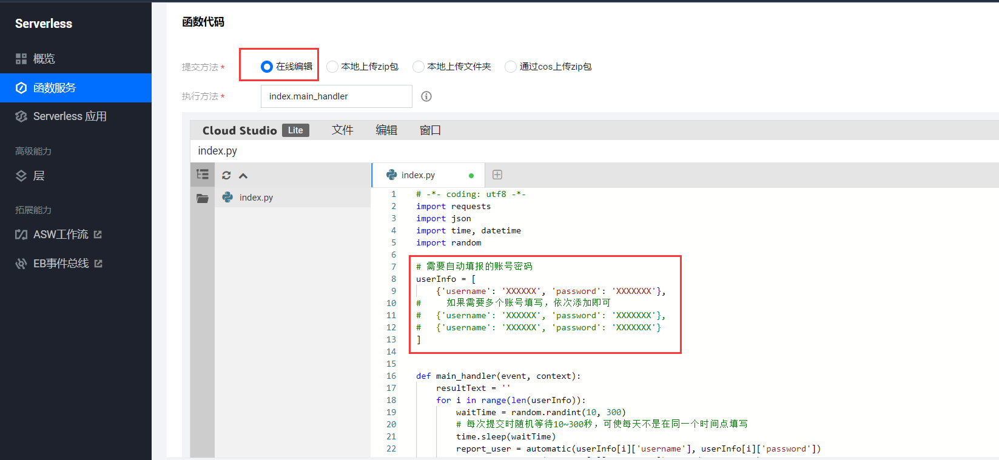
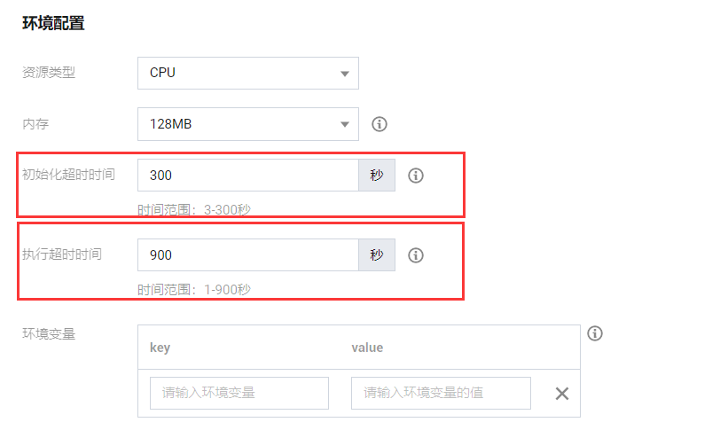
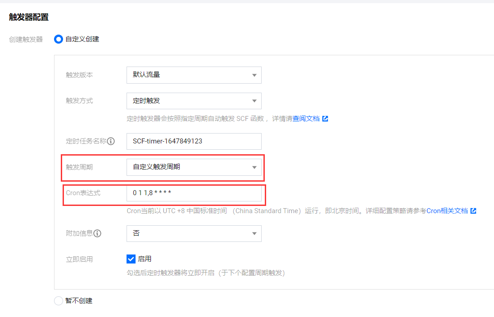
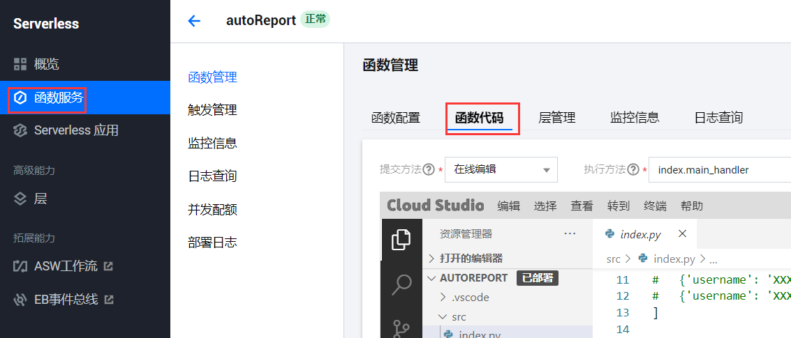
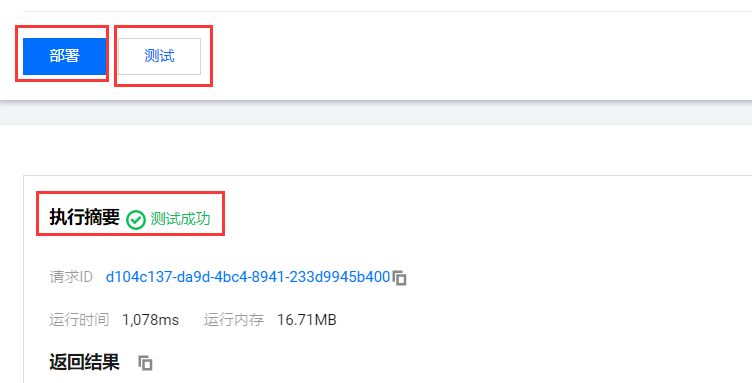

# UPC 中国石油大学（华东）疫情防控通自动填报

## **免责申明**

此脚本仅供参考学习，本人不对本脚本产生的任何影响负责。

请于下载本脚本之后24小时内彻底删除本脚本。

下载本脚本即视为同意此免责声明。

## 使用方法

### 1.登入腾讯云函数

进入[腾讯云函数界面](https://console.cloud.tencent.com/scf)，（如果没有账号先注册一个，无门槛，人人可注册使用）；

### 2.编辑云函数

点击【函数服务】->【新建】;

选择【从头开始】

函数类型：选择"事件函数"

函数名称：自己命名规范任意填写

地域：任意选择，默认的“广州”就行

**注意！**

【运行环境】选择**“Python 3.6”**

在【函数代码】部分，选择【在线编辑】，复制文件“autoReport.py"里的代码，然后在userInfo里填入数字石大的账号密码；

在【高级配置】里，修改【环境配置】里

初始化超过时间：300

执行超过时间：900

其余地方无需修改；

在【触发器配置】里

触发周期 选择：“自定义触发周期”

Cron表达式 输入：`0 1 1,8 * * * *`，该触发时间为每天的01:01和08:01，两次提交防止因为某原因而填报失败。

点击左下角【完成】，即可完成函数编辑。

### 3.云函数测试、部署

正常点击”完成“后会跳转到”函数管理“界面，如果无跳转，可在左侧【函数服务】里，选择刚才自定义的函数名称进入。

进入后选择【函数代码】

点击下方【部署】，最后点击【测试】；

如果出现“测试成功”，则说明全部成功。

### 注意事项！！！

**代码原理：**自动获取昨日填写的信息，进行填报。

故每次变更地点（比如从学校回家里，或从家里回学校），都要自己手动在凌晨1：01前填报2次！**手动填报2次！2次！2次！**

（因为第一次是会填写变更原因，第二次才会恢复正常的内容）